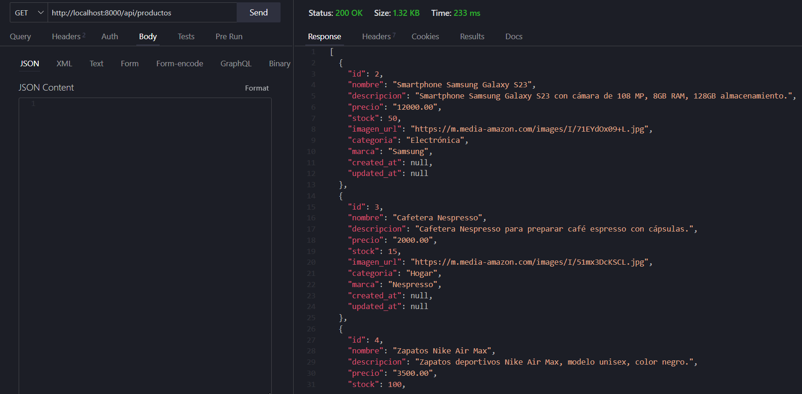

## API Laravel

### 1. Instalación y Descarga

```bash
git clone <url-del-repositorio>
cd <nombre-del-repositorio>
```

#### 1.2. Instalar dependencias con Composer

Una vez dentro del directorio del proyecto, instala las dependencias de Laravel utilizando Composer

```bash
composer install
```

#### 1.3. Configurar el archivo `.env`

Copia el archivo `.env.example` y renómbralo a `.env` para configurar las variables de entorno

```bash
cp .env.example .env
```

Abre el archivo `.env` en un editor de texto y configura los parámetros de conexión a la base de datos MySQL

```env
DB_CONNECTION=mysql
DB_HOST=127.0.0.1
DB_PORT=3306
DB_DATABASE=nombre_de_base_de_datos
DB_USERNAME=usuario_mysql
DB_PASSWORD=contraseña_mysql
```

Reemplaza `nombre_de_base_de_datos`, `usuario_mysql`, y `contraseña_mysql` con la información correspondiente al entorno de base de datos.

#### 1.4. Ejecutar las migraciones y rellenar registros

```bash
php artisan migrate --seed
```

#### 1.5. Iniciar el servidor de desarrollo

```bash
php artisan serve
```

Se pueden consultar los endpoints usando `php artisan route:list`

### 2. Desarrollo

#### 2.1 Estructura del Proyecto

##### 2.1.1 Migraciones

Se crean las migraciones pertinentes para el uso de este proyecto.

###### Usuarios

```php
Schema::create('users', function (Blueprint $table) {
    $table->id();
    $table->string('name');
    $table->string('email')->unique();
    $table->string('image_url')->nullable();
    $table->timestamp('email_verified_at')->nullable();
    $table->string('password');
    $table->rememberToken();
    $table->timestamps();
});
```

###### Productos

```php
Schema::create('productos', function (Blueprint $table) {
    $table->id();
    $table->string('nombre');
    $table->text('descripcion');
    $table->decimal('precio', 12, 2);
    $table->integer('stock');
    $table->string('imagen_url')->nullable(true);
    $table->string('categoria');
    $table->string('marca');
    $table->timestamps();
});
```

##### 2.1.2 Modelos
Se utilizan dos modelos para este proyecto, `User` y `Producto`:
_User Model_
```PHP
class User extends Authenticatable
{
    use HasApiTokens, HasFactory, Notifiable;

    protected $fillable = [
        'name',
        'email',
        'password',
        'image_url',
    ];

    protected $hidden = [
        'password',
        'remember_token',
    ];

    protected function casts(): array
    {
        return [
            'email_verified_at' => 'datetime',
            'password' => 'hashed',
        ];
    }
}
```

_Producto Model_
```PHP
class Producto extends Model
{
    use HasFactory;

    protected $table = 'productos';

    protected $fillable = [
        'nombre',
        'descripcion',
        'precio',
        'stock',
        'imagen_url',
        'categoria',
        'marca',
    ];
}
```

##### 2.1.3 Controladores

Creamos los controladores necesarios para la manipulación de los datos.

```bash
php artisan make:controller AuthenticationController

php artisan make:controller ProductoController

php artisan make:controller UserController
```

_Authentication Controller_
Este controlador permite la autenticacion del usuario dentro del sistema: `register`, `login`, `logout`.

```php
class AuthenticationController extends Controller
{
    public function register(Request $request)
    {
        $request->validate([
            'nombre' => 'required|string',
            'email' => 'required|email|unique:users',
            'url_foto' => 'required|url',
            'password' => 'required|string|min:6',
        ]);

        $user = User::create([
            'nombre' => $request->nombre,
            'email' => $request->email,
            'url_foto' => $request->url_foto,
            'password' => Hash::make($request->password),
        ]);

        $token = $user->createToken($user->email)->plainTextToken;

        return response()->json([
            'user' => $user,
            'token' => $token,
        ], 201);
    }

    public function login(Request $request)
    {
        $request->validate([
            'email' => 'required|email',
            'password' => 'required|string',
        ]);

        $user = User::where('email', $request->email)->first();

        if (! $user || ! Hash::check($request->password, $user->password)) {
            throw ValidationException::withMessages([
                'email' => ['Credenciales no válidas.'],
            ]);
        }

        $token = $user->createToken('authToken')->plainTextToken;

        return response()->json([
            'user' => $user,
            'token' => $token,
        ]);
    }

    public function logout(Request $request)
    {
        $request->user()->currentAccessToken()->delete();

        return response()->json([
            'message' => 'Se ha cerrado la sesión.'
        ]);
    }
}
```

_User Controller_
Este controlador permite el CRUD de usuarios a través de metodos como:`GET`, `POST`, `PUT`, `DELETE`.

```php
   class UserController extends Controller
{
    //Obtiene la lista de Usuarios
    public function index()
    {
        return response()->json(User::all(), 200);
    }

    //Crea un nuevo usuario
    public function store(Request $request)
    {
        $validatedData = $request->validate([
            'name' => 'required|string|max:255',
            'email' => 'required|email|unique:users,email',
            'password' => 'required|string|min:8',
            'image_url' => 'nullable|url',
        ]);

        $validatedData['password'] = Hash::make($validatedData['password']);
        $user = User::create($validatedData);

        return response()->json($user, 201);
    }

    //Obtiene un Usuario en especifico
    public function show($id)
    {
        $user = User::find($id);

        if (!$user) {
            return response()->json(['error' => 'Usuario no encontrado'], 404);
        }

        return response()->json($user, 200);
    }

    //Actualizar un Usuario
    public function update(Request $request, $id)
    {
        $user = User::find($id);

        if (!$user) {
            return response()->json(['error' => 'Usuario no encontrado'], 404);
        }

        $validatedData = $request->validate([
            'name' => 'required|string|max:255',
            'email' => [
                'required',
                'email',
                Rule::unique('users', 'email')->ignore($user->id),
            ],
            'password' => 'nullable|string|min:8',
            'image_url' => 'required|url',
        ]);

        if (!empty($validatedData['password'])) {
            $validatedData['password'] = Hash::make($validatedData['password']);
        } else {
            unset($validatedData['password']);
        }

        $user->update($validatedData);

        return response()->json($user, 200);
    }

    //Eliminar un Usuario
    public function destroy($id)
    {
        $user = User::find($id);
        if (!$user) {
            return response()->json(['error' => 'Usuario no encontrado'], 404);
        }
        $user->delete();

        return response()->json(['message' => 'Usuario eliminado'], 200);
    }
}
```

_Producto Controller_
Este controlador permite el CRUD de productos a través de metodos como:`GET`, `POST`, `PUT`, `DELETE`.

```php
class ProductoController extends Controller
{
    // Obtener todos los productos
    public function index()
    {
        $productos = Producto::all(); 
        return response()->json($productos);
    }

    // Obtener un producto por su ID
    public function show(Producto $producto)
    {
        return response()->json($producto);
    }

    // Crear un nuevo producto
    public function store(Request $request)
    {
        $request->validate([
            'nombre' => 'required|string|max:255',
            'descripcion' => 'required|string',
            'precio' => 'required|numeric',
            'stock' => 'required|integer',
            'imagen_url' => 'nullable|url',
            'categoria' => 'required|string|max:255',
            'marca' => 'required|string|max:255',
        ]);

        $producto = Producto::create([
            'nombre' => $request->nombre,
            'descripcion' => $request->descripcion,
            'precio' => $request->precio,
            'stock' => $request->stock,
            'imagen_url' => $request->imagen_url,
            'categoria' => $request->categoria,
            'marca' => $request->marca,
        ]);

        return response()->json($producto, 201);
    }

    // Actualizar un producto existente
    public function update(Request $request, Producto $producto)
    {
        $request->validate([
            'nombre' => 'string|max:255',
            'descripcion' => 'string',
            'precio' => 'numeric',
            'stock' => 'integer',
            'imagen_url' => 'url',
            'categoria' => 'string|max:255',
            'marca' => 'string|max:255',
        ]);

        $producto->update($request->only([
            'nombre',
            'descripcion',
            'precio',
            'stock',
            'imagen_url',
            'categoria',
            'marca',
        ]));

        return response()->json($producto);
    }

    // Eliminar un producto
    public function destroy(Producto $producto)
    {
        $producto->delete();
        return response()->json(['message' => 'Producto eliminado']);
    }
}
```

##### 2.1.4 Rutas/Endpoints

Con ayuda de comando:

```bash
php artisan install:api
```

Creamos el archivo `api.php` que nos permite crear los endpoints para nuestra API.

```php
<?php

use App\Http\Controllers\AuthenticationController;
use App\Http\Controllers\ProductoController;
use App\Http\Controllers\UserController;
use Illuminate\Http\Request;
use Illuminate\Support\Facades\Route;

Route::get('/user', function (Request $request) {
    return $request->user();
})->middleware('auth:sanctum');

Route::post('/register', [AuthenticationController::class, 'register']);
Route::post('/login', [AuthenticationController::class, 'login']);
Route::middleware('auth:sanctum')->post('/logout', [AuthenticationController::class, 'logout']);

Route::resource('productos', ProductoController::class);
Route::resource('users', UserController::class);
```

### 3. Resultados
#### Autenticación


#### Usuarios


#### Productos



